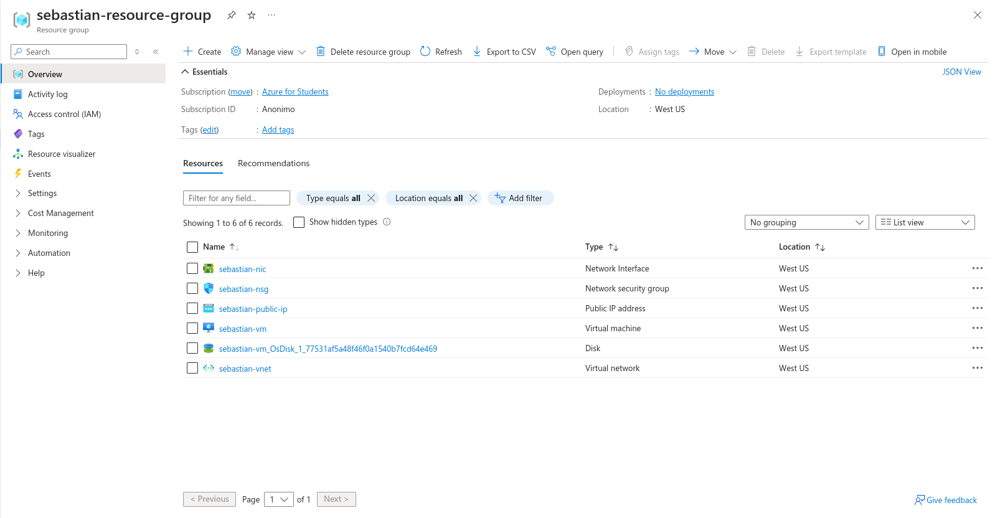
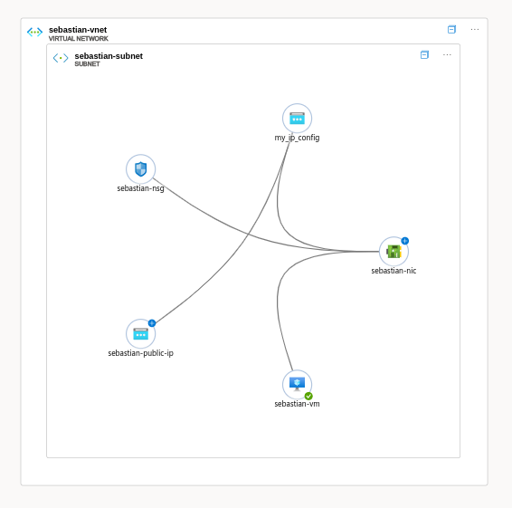
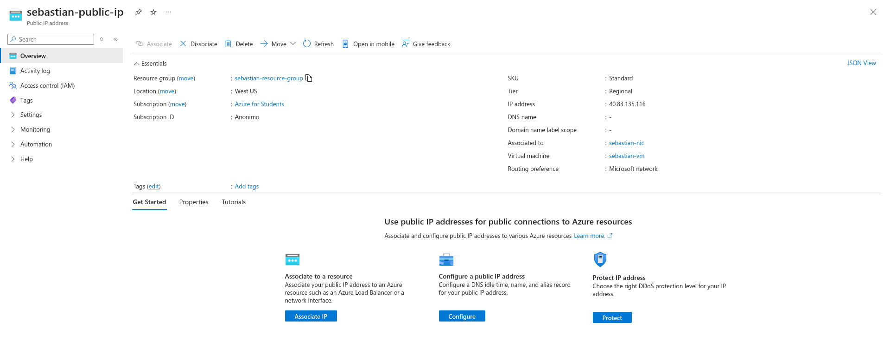
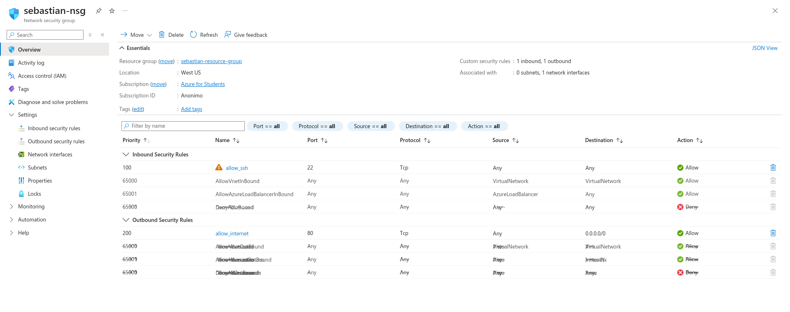
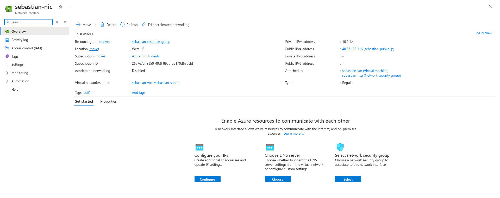
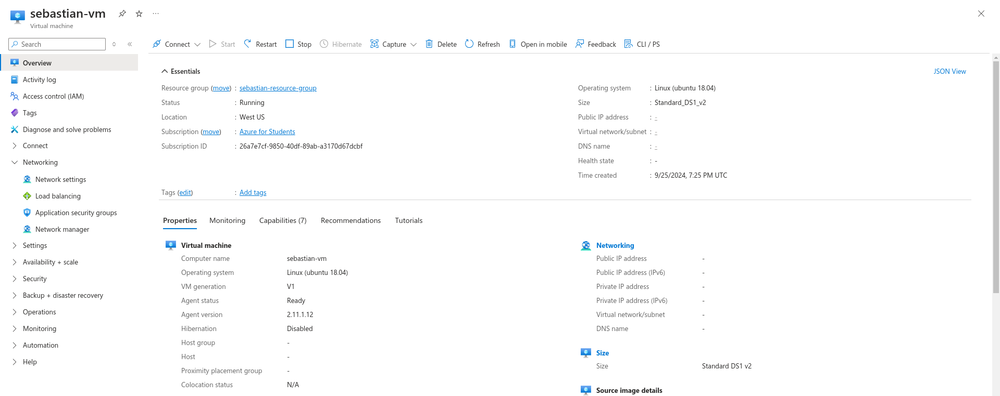

# **🌍 Informe de Despliegue con Terraform 🚀**

---

### **Introducción**

Este informe detalla el proceso de despliegue realizado en Azure utilizando **Terraform**. El objetivo es crear una infraestructura que incluye una red virtual, una subred, una máquina virtual Linux, y varios recursos asociados, todo desplegado automáticamente.

---

### **Componentes del Despliegue**

#### **1. Proveedor de Azure (🔧 provider "azurerm")**
Este bloque define el proveedor de Azure que nos permite interactuar con los recursos de Azure mediante Terraform.

```hcl
provider "azurerm" {
  subscription_id = var.subscription_id
  features {}
}
```
> 💡 *Este proveedor utiliza la suscripción de Azure configurada mediante variables*.

---

#### **2. Grupo de Recursos (📦 azurerm_resource_group)**

El grupo de recursos es el contenedor donde se agrupan todos los recursos de Azure.

```hcl
resource "azurerm_resource_group" "rg_sebastian" {
  name     = var.resource_group_name
  location = var.location
}
```

> 💡 *Aquí estamos creando el grupo de recursos en la región seleccionada (westus)*.



---

#### **3. Red Virtual (🌐 azurerm_virtual_network)**

La red virtual es el entorno de red en el que se despliegan todos los recursos.

```hcl
resource "azurerm_virtual_network" "vnet_sebastian" {
  name          = var.vnet_name
  address_space = [var.vnet_address_space]
  location      = azurerm_resource_group.rg_sebastian.location
}
```

> 💡 *Define el espacio de direcciones IP utilizado por los recursos de la red*.


---

#### **4. Subnet (🔌 azurerm_subnet)**

Las subnets son divisiones dentro de la red virtual.

```hcl
resource "azurerm_subnet" "subnet_vnet_sebastian" {
  name                 = var.subnet_name
  address_prefixes     = [var.subnet_address_prefix]
}
```

> 💡 *Se crea una subnet dentro de la red virtual con un prefijo de direcciones IP específico*.



---

#### **5. IP Pública (🌍 azurerm_public_ip)**

Se crea una IP pública estática para la máquina virtual, lo que permite el acceso externo.

```hcl
resource "azurerm_public_ip" "public_ip_first_vm" {
  name              = var.public_ip_name
  allocation_method = "Static"
}
```

> 💡 *Esta IP será utilizada para conectarse a la VM desde Internet*.



---

#### **6. Grupo de Seguridad de Red (🔐 azurerm_network_security_group)**

Este recurso controla las reglas de seguridad para el tráfico hacia y desde la VM.

```hcl
resource "azurerm_network_security_group" "nsg_sebastian_first" {
  name = var.nsg_name
}
```

> 💡 *Define reglas para permitir el tráfico SSH y el acceso a Internet*.


---

#### **7. Interfaz de Red (📡 azurerm_network_interface)**

Se conecta la VM a la red virtual y se le asigna la IP pública.

```hcl
resource "azurerm_network_interface" "nic_sebastian_first" {
  name = var.nic_name

  ip_configuration {
    subnet_id             = azurerm_subnet.subnet_vnet_sebastian.id
    public_ip_address_id  = azurerm_public_ip.public_ip_first_vm.id
  }
}
```

> 💡 *Aquí conectamos la VM a la red y asociamos su IP pública*.



---

#### **8. Máquina Virtual (💻 azurerm_linux_virtual_machine)**

Se despliega una máquina virtual con **Ubuntu** como sistema operativo.

```hcl
resource "azurerm_linux_virtual_machine" "vm_sebastian_first" {
  name                = var.vm_name
  admin_username      = var.admin_username
  admin_password      = var.admin_password
}
```

> 💡 *La VM incluye Ubuntu 18.04, y se permite la autenticación con contraseña*.



---

#### **9. Asociación del Grupo de Seguridad (🔗 azurerm_network_interface_security_group_association)**

Se asocia el grupo de seguridad con la interfaz de red.

```hcl
resource "azurerm_network_interface_security_group_association" "nic_nsg_association_sebastian_first" {
  network_interface_id      = azurerm_network_interface.nic_sebastian_first.id
  network_security_group_id = azurerm_network_security_group.nsg_sebastian_first.id
}
```

> 💡 *Esto aplica las reglas de seguridad a la interfaz de red de la VM*.

---

### **Salidas (Outputs) 📤**

Una vez desplegada la infraestructura, se muestran varias salidas importantes:

- **Public IP**: Muestra la dirección IP pública de la máquina virtual.
- **VNet Name**: Nombre de la red virtual.
- **Subnet Name**: Nombre de la subnet creada.
- **VM ID**: Identificador único de la máquina virtual.

---

### **Pasos para Completar el Despliegue 🛠️**

1. **Configurar Variables**: Asegúrate de ajustar correctamente las variables en `variables.tf`.
2. **Inicializar y Planificar**: Ejecuta los comandos:
   ```bash
   terraform init
   terraform plan
   ```
3. **Aplicar el Despliegue**: Despliega la infraestructura con:
   ```bash
   terraform apply
   ```
4. **Verificar las Salidas**: Una vez aplicado el despliegue, revisa las salidas generadas por Terraform.

---

### **Conclusión 🏁**

El despliegue automatizado con Terraform facilita la creación y gestión de recursos en Azure de manera eficiente. Este enfoque asegura que los recursos se desplieguen de forma coherente y escalable. Gracias a las capturas de pantalla incluidas, el proceso es más visual y sencillo de seguir. ¡Terraform permite un control total sobre los recursos en la nube! 🚀
