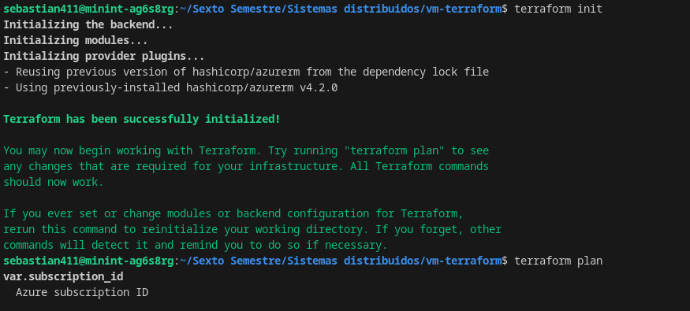
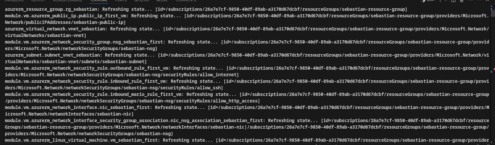
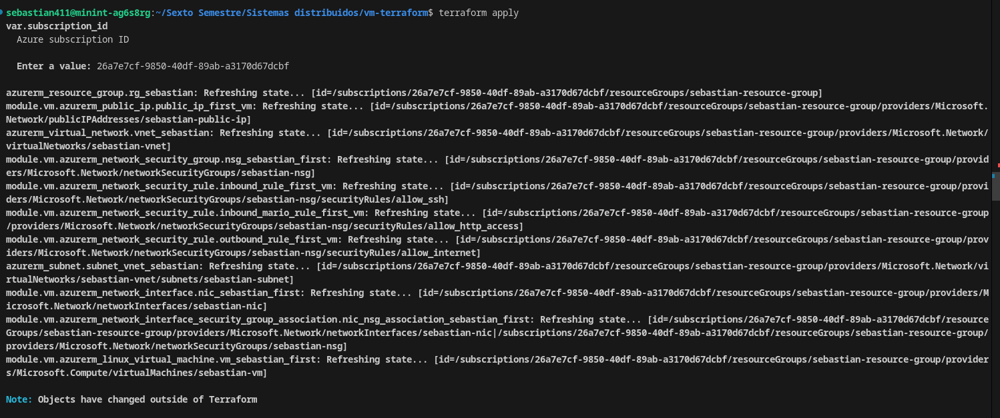
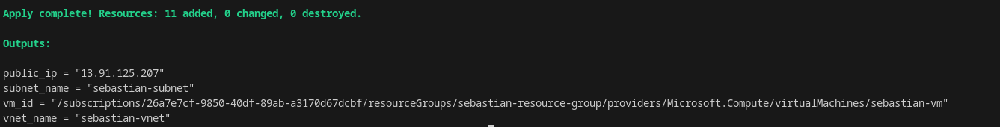

# **🌍 Informe de Despliegue Modular con Terraform 🚀**

---

### **Introducción**

Este informe detalla el proceso de despliegue realizado en Azure utilizando **Terraform** con un enfoque modular. El objetivo es crear una infraestructura que incluye una red virtual, una subred, una máquina virtual Linux, y varios recursos asociados, todo desplegado automáticamente y organizado en módulos para facilitar la reutilización y el mantenimiento.

---

### **Componentes del Despliegue Modular**

#### **1. Proveedor de Azure (🔧 provider "azurerm")**

El proveedor de Azure permite interactuar con los recursos de Azure mediante Terraform. Se ha configurado el proveedor utilizando la suscripción de Azure definida en las variables.

```hcl
provider "azurerm" {
  subscription_id = var.subscription_id
  features {}
}
```
> 💡 *Este bloque asegura que Terraform pueda gestionar recursos en Azure mediante la suscripción correspondiente*.

---

#### **2. Grupo de Recursos (📦 azurerm_resource_group)**

El grupo de recursos es el contenedor donde se agrupan todos los recursos de Azure. Se despliega fuera de los módulos para ser reutilizado por otros recursos.

```hcl
resource "azurerm_resource_group" "rg_sebastian" {
  name     = var.resource_group_name
  location = var.location
}
```
> 💡 *Agrupa todos los recursos en una ubicación específica*.

---

#### **3. Red Virtual y Subnet (🌐 azurerm_virtual_network y azurerm_subnet)**

La red virtual y la subred se configuran de manera modular. Esto permite definir la infraestructura de red y dividirla en segmentos más pequeños.

```hcl
module "network" {
  source              = "./modules/network"
  location            = azurerm_resource_group.rg_sebastian.location
  resource_group_name = azurerm_resource_group.rg_sebastian.name
}
```

> 💡 *La red virtual y la subred se declaran dentro del módulo para mantener la infraestructura organizada y reutilizable*.

---

#### **4. Módulo de Máquina Virtual (💻 módulo "vm")**

El módulo de la máquina virtual despliega una VM con **Ubuntu** como sistema operativo, gestionando la IP pública, la interfaz de red, y las reglas de seguridad.

```hcl
module "vm" {
  source              = "./modules/vm"
  location            = azurerm_resource_group.rg_sebastian.location
  resource_group_name = azurerm_resource_group.rg_sebastian.name
  subnet_id           = module.network.subnet_id
}
```
> 💡 *Este módulo simplifica la creación de una VM con su red asociada, seguridad y asignación de IP*.

---

### **Estructura Modular**

#### **Módulo de Red (`modules/network`)**

Este módulo crea una red virtual y una subred en Azure, gestionando todo lo relacionado con la configuración de la red.

```hcl
# Virtual Network
resource "azurerm_virtual_network" "vnet" {
  name                = var.vnet_name
  address_space       = [var.vnet_address_space]
  location            = var.location
  resource_group_name = var.resource_group_name
}

# Subnet
resource "azurerm_subnet" "subnet" {
  name                 = var.subnet_name
  resource_group_name  = var.resource_group_name
  virtual_network_name = azurerm_virtual_network.vnet.name
  address_prefixes     = [var.subnet_address_prefix]
}
```

---

#### **Módulo de Máquina Virtual (`modules/vm`)**

El módulo de VM incluye la creación de la máquina virtual, IP pública, interfaz de red, y las reglas de seguridad necesarias para su funcionamiento.

```hcl
# Public IP
resource "azurerm_public_ip" "public_ip" {
  name                = var.public_ip_name
  location            = var.location
  resource_group_name = var.resource_group_name
  allocation_method   = "Static"
}

# Network Interface
resource "azurerm_network_interface" "nic" {
  name                = var.nic_name
  location            = var.location
  resource_group_name = var.resource_group_name

  ip_configuration {
    name                          = "my_ip_config"
    subnet_id                     = var.subnet_id
    public_ip_address_id          = azurerm_public_ip.public_ip.id
    private_ip_address_allocation = "Dynamic"
  }
}

# Virtual Machine
resource "azurerm_linux_virtual_machine" "vm" {
  name                = var.vm_name
  location            = var.location
  resource_group_name = var.resource_group_name
  size                = var.vm_size
  admin_username      = var.admin_username
  admin_password      = var.admin_password
}
```

> 💡 *Este módulo organiza los recursos asociados a la VM, facilitando su mantenimiento y reutilización*.

---

### **Salidas (Outputs) 📤**

Una vez desplegada la infraestructura, se muestran varias salidas importantes, incluidas la IP pública, el nombre de la red virtual y el ID de la VM.

```hcl
# Output de la IP pública
output "public_ip" {
  description = "La IP pública de la máquina virtual"
  value       = module.vm.public_ip
}

# Output de la Red Virtual
output "vnet_name" {
  description = "Nombre de la red virtual"
  value       = module.network.vnet_name
}
```

> 💡 *Los outputs muestran información clave del despliegue, permitiendo una verificación rápida de los recursos creados*.

---

### **Pasos para Completar el Despliegue 🛠️**

1. **Configurar Variables**: Asegúrate de ajustar correctamente las variables en `variables.tf`.
2. **Inicializar y Planificar**: Ejecuta los comandos:
   ```bash
   terraform init
   terraform plan
   ```
   
   
   
3. **Aplicar el Despliegue**: Despliega la infraestructura con:
   ```bash
   terraform apply
   ```
   
   

4. **Verificar las Salidas**: Una vez aplicado el despliegue, revisa las salidas generadas por Terraform.

---

### **Conclusión 🏁**

La utilización de módulos en Terraform facilita la organización y reutilización de recursos, permitiendo una gestión más eficiente y escalable en Azure. El enfoque modular no solo organiza el código, sino que también simplifica futuras expansiones de la infraestructura. ¡Con Terraform y Azure, el despliegue es más ágil y escalable! 🚀